# Commit Critter 🐌🦀🐱🫧

A tiny pet that lives in your GitHub README and eats your real GitHub activity.

Once a day, a GitHub Action visits your critter and feeds it whatever you actually did on GitHub in the last 24 hours: pushes, PRs, reviews, issues. Do real work and it thrives. Skip a few days and it gets hungry, and everyone visiting your profile can see it.

<picture>
  <source media="(prefers-color-scheme: dark)" srcset="assets/card-dark.svg">
  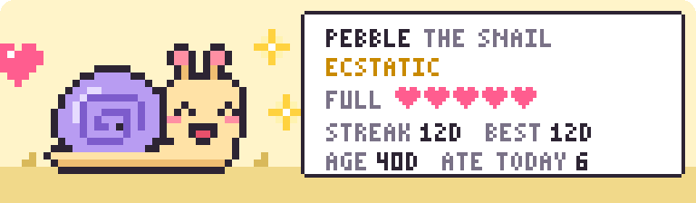
</picture>

---

## Setup (2 minutes)

1. Open your **profile repo**, the one named after you (`github.com/<you>/<you>`). Any public repo works, but that's the one shown on your profile.
2. Create `.github/workflows/commit-critter.yml` with:

```yaml
name: Commit Critter
on:
  schedule:
    - cron: "30 6 * * *"   # once a day; pick a mid-day time in your timezone (UTC)
  workflow_dispatch:
permissions:
  contents: write
jobs:
  feed:
    runs-on: ubuntu-latest
    steps:
      - uses: actions/checkout@v5
      - uses: Diacod-I/commit-critter@v1
        with:
          species: snail   # snail, crab, cat, or slime
          # theme: dark    # light (default) or dark
```

3. On the **Actions** tab, click **Commit Critter → Run workflow** to hatch it.

That's it, with no tokens or secrets to set up. The critter appears at the bottom of your README. To put it somewhere else, add these two lines wherever you want it and it'll stay there:

```md
<!-- COMMIT-CRITTER:START -->
<!-- COMMIT-CRITTER:END -->
```

## The critters

| snail | crab | cat | slime |
|---|---|---|---|
| <picture><source media="(prefers-color-scheme: dark)" srcset="assets/snail-happy-dark.svg"></picture> | <picture><source media="(prefers-color-scheme: dark)" srcset="assets/crab-happy-dark.svg"></picture> | <picture><source media="(prefers-color-scheme: dark)" srcset="assets/cat-happy-dark.svg"></picture> | <picture><source media="(prefers-color-scheme: dark)" srcset="assets/slime-happy-dark.svg"></picture> |

Each has five moods and its own diary voice. The critter and its stats are drawn as one animated SVG card saved to `.critter/critter.svg`, so it bobs, blinks and sulks right in your README:

| ecstatic | happy | meh | hungry | starving |
|---|---|---|---|---|
| <picture><source media="(prefers-color-scheme: dark)" srcset="assets/cat-ecstatic-dark.svg">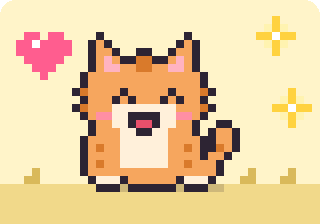</picture> | <picture><source media="(prefers-color-scheme: dark)" srcset="assets/cat-happy-dark.svg"></picture> | <picture><source media="(prefers-color-scheme: dark)" srcset="assets/cat-meh-dark.svg"></picture> | <picture><source media="(prefers-color-scheme: dark)" srcset="assets/cat-hungry-dark.svg"></picture> | <picture><source media="(prefers-color-scheme: dark)" srcset="assets/cat-starving-dark.svg">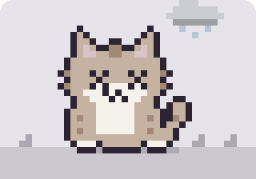</picture> |

## Options

| input | default | |
|---|---|---|
| `species` | `snail` | `snail`, `crab`, `cat`, `slime` |
| `size` | `medium` | `small`, `medium` or `full`; see [sizes](#sizes) below |
| `width` | per size | the card's width in the README, in pixels or a percentage. Pixel art stays sharpest at multiples of the card's width in art pixels: 44 for `small` (176, 220, 264), 96 for `medium` (384, 480, 576) |
| `float` | `none` | `left` or `right` floats the card beside your README's text; the card then links to the diary instead of having a caption line. Put the markers *before* the text that should wrap around it |
| `theme` | `light` | `light` or `dark` card colours; `dark` sits well next to dark stat widgets |
| `pet-name` | per species | Pebble, Clawdia, Biscuit, Gloop |
| `readme` | `README.md` | which file to draw in |
| `github-user` | repo owner | whose activity feeds it |
| `author-name` / `author-email` | your profile | commit author; the default noreply address always counts toward your graph |
| `push` | `true` | `false` for a dry run |

| `theme: light` | `theme: dark` |
|---|---|
|  | 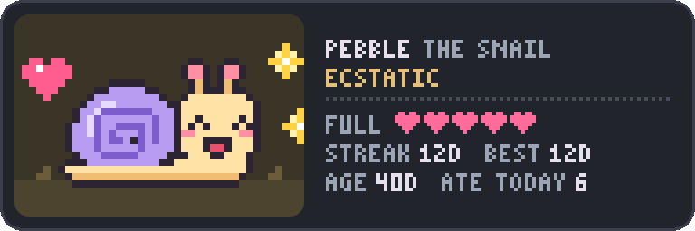 |

### Sizes

Each size shows different data, so pick the one that fits your README:

- **`small`:** a portrait card with the critter on top, and its name, mood, fullness and streak below. Pair it with `float: right` to sit beside your intro.
- **`medium`** (default): the critter with all of today's stats.
- **`full`:** everything in `medium`, plus a bar chart of what it ate over the last 7 days and its lifetime total. Spans the full width of the README.

| `size: small` | `size: medium` |
|---|---|
| <picture><source media="(prefers-color-scheme: dark)" srcset="assets/card-small-dark.svg">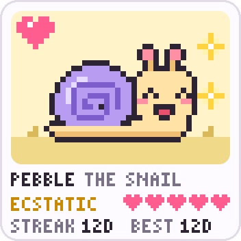</picture> | <picture><source media="(prefers-color-scheme: dark)" srcset="assets/card-dark.svg"></picture> |

<picture><source media="(prefers-color-scheme: dark)" srcset="assets/card-full-dark.svg">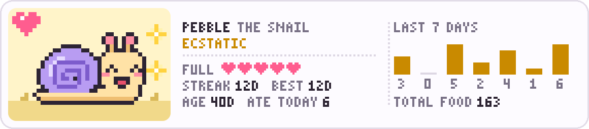</picture>

## How it works

Each run makes **1–3 commits** as you:

1. **Feed:** reads your public events from the last 24h, updates `.critter/state.json`, redraws the sprite in `.critter/critter.svg`, and updates the README.
2. **Diary:** appends an entry to `.critter/diary.md` in the critter's voice.
3. **Trophy:** only on milestone days (7, 30, 100 or 365 days of real work in a row) → `.critter/trophies.md`.

Activity in the critter's own repo is ignored, so it can't feed itself. If GitHub's API has a hiccup, the critter naps: it still commits, but it isn't rewarded or punished.

## FAQ

**Isn't this just a streak bot?**
Partly, and it says so: the commits keep your graph green. What's different is that the critter tells the truth. Your graph can be green while your snail is clearly starving in its shell. It's a small daily nudge to go do something real.

**Will the commits count on my contribution graph?**
Yes, if the repo is public (or you've enabled private contributions) and the commits land on the default branch. By default they're authored as `<id>+<login>@users.noreply.github.com`, which GitHub always links to your account.

**What counts as food?**
Public pushes, PRs, PR reviews, issues, issue comments, new branches/repos and releases. Private-repo activity doesn't show up in the public events API, so it isn't counted.

**Why does my scheduled run sometimes start late?**
GitHub delays scheduled workflows when it's busy, sometimes by 30+ minutes. That's why the example runs mid-day: so it never slips into the next date.

## Contributing

New critters are the easiest contribution: draw a body grid in `sprites.py` (fill colours only; the outline, face and mood effects are added for you), add diary lines for all five moods to `SPECIES` in `critter.py`, then regenerate the previews and run the tests:

```bash
python3 critter.py preview assets
python3 -m unittest discover -v tests
```

## License

MIT
